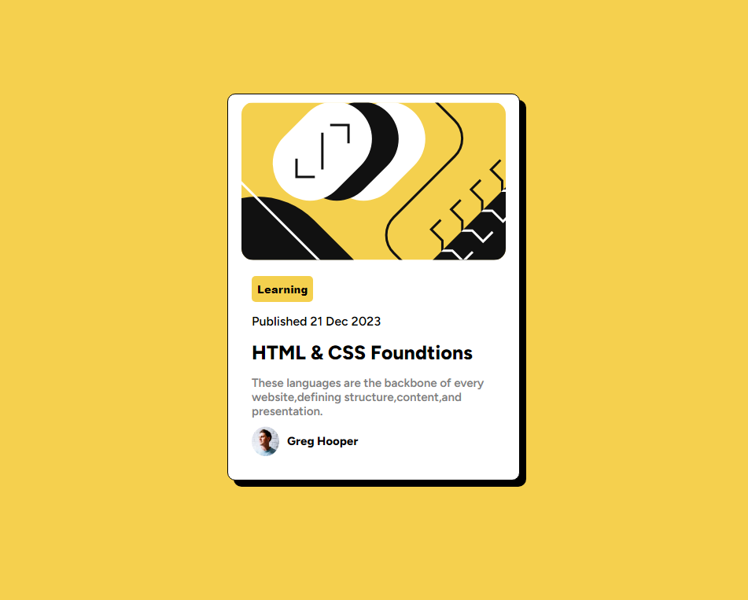

# blog-preview-card

## Table of contents

- [Overview](#overview)
  - [Screenshot](#screenshot)
  - [Links](#links)
- [My process](#my-process)
  - [Built with](#built-with)
  - [What I learned](#what-i-learned)
  - [Useful resources](#useful-resources)
- [Author](#author)

## Overview
A simple card design 
### Screenshot

### Links

- Solution URL: [Add solution URL here](https://your-solution-url.com)
- Live Site URL: [Add live site URL here](https://your-live-site-url.com)

## My process

### Built with

- Semantic HTML5 markup
- CSS custom properties
- Flexbox

### What I learned

I learn how to make a website with HTML & CSS ,style the elements , how to position the elements. 

### Useful resources

- [resource 2](https://fonts.google.com/specimen/Bai+Jamjuree) - This is an amazing website which helped me for styling the website font.

## Author
- Frontend Mentor - [@Hajerabdeen](https://www.frontendmentor.io/profile/Hajerabdeen)

